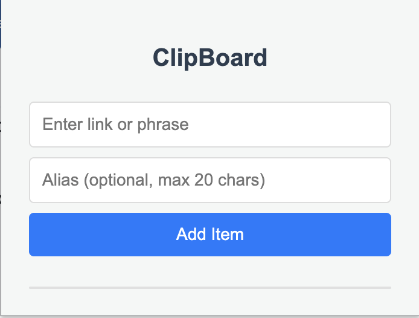

# minimal-clipboard
Extension to copy common words and links.
- [x] Input an form of word or sentence
- [x] Add an optional alias to your input.
- [x] All items will be in a list
- [x] Can copy, reorder, delete the item.

## UI

